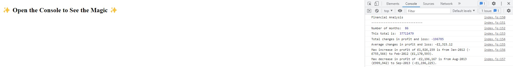

# Console-Finances
Module 4 Challenge
Task: I had to take an array of months, profits and losses. The task was to make calculations and print out the results. 
I had to make 6 calculations.
1. Find out number of months included in array
2. Total profits and losses.
3. Total changes in profits and losses.
4. Average changes in profits and losses.
5. The greatest increase in profits (date and amount) over the entire period.
6. The greatest decrease in losses (date and amount) over the entire period.

https://mystfreak.github.io/Console-Finances/
